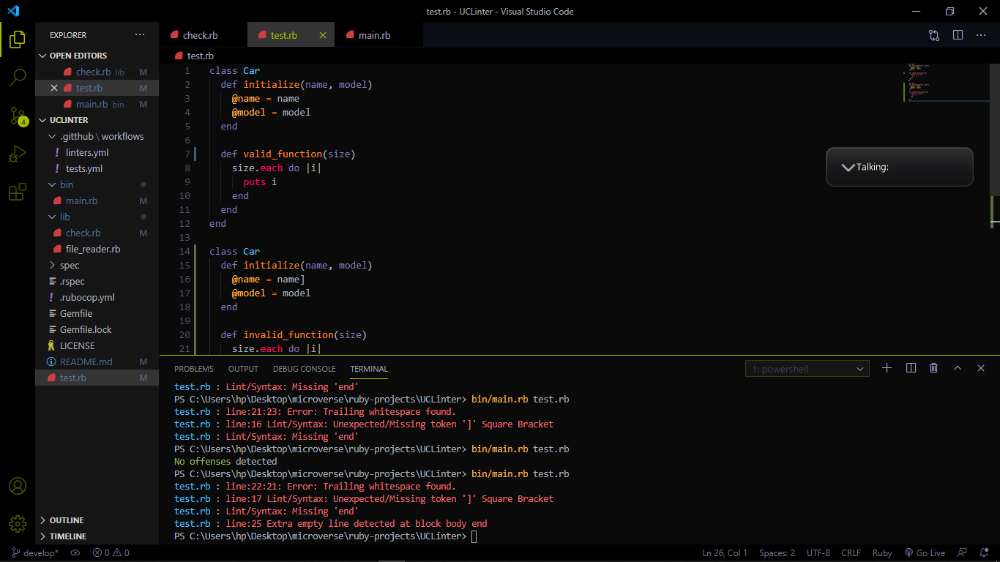

# Ruby Capstone Project: Ruby Linter

[](https://github.com/uchennaanya/UCLinter)
[](https://github.com/uchennaanya/UCLinter/issues)
[](https://github.com/uchennaanya/UCLinter/pulls)

# About

This project is about building a custom Linter that makes sure that code conforms to ruby community standard.

# The Build

This custom linter currently checks for the following errors in a ruby file.


- checks for trailing white spaces errors
- checks for missing/unexpected tags example
- checks for missing/unexpected end of file
- checks for empty line errors

> Below image dicpicts what a valid and invalid codes are



## Built With

- [Ruby](https://www.ruby-lang.org/en/)

# Getting Started

To get a local copy of the repository please run the following commands on your terminal:

```
$ cd to a desired <folder>
```

```
$ git clone https://github.com/uchennaanya/UCLinter.git
```

```bash
$ bundle install
```

**To check for errors on a file:**

```bash
$ bin/main.rb test.rb
```
Note: The linter does not run in all cases until the complete file path is added to the file to be tested.

## Testing

To test the code, run `rspec` from root of the folder using terminal.
Note: `test.rb` has been excluded from rubocop checks to allow RSpec testing without interfering with Gitflow actions

> Rspec is used for the test, to install the gem file, run

```bash
$ bundle install
```

> But before that, make sure you have **bundler** installed on your system, else run

```bash
$ gem install bundler
```

> or you simply install the the following directly using

```bash
$ gem install rspec
```

```bash
$ gem install colorize
```

# Author

👤 **Uchenna Anya**

- Github: [uchennnaanya](https://github.com/uchennaanya/)
- Twitter: [@martinsanya19](https://twitter.com/martinsanya19)
- Linkedin: [uchenna-anya](https://www.linkedin.com/in/uchenna-anya/)

## 🤝 Contributing

Contributions, issues and feature requests are welcome!

## Show your support

Give a ⭐️ if you like this project!

## Acknowledgment

- stack overflow
